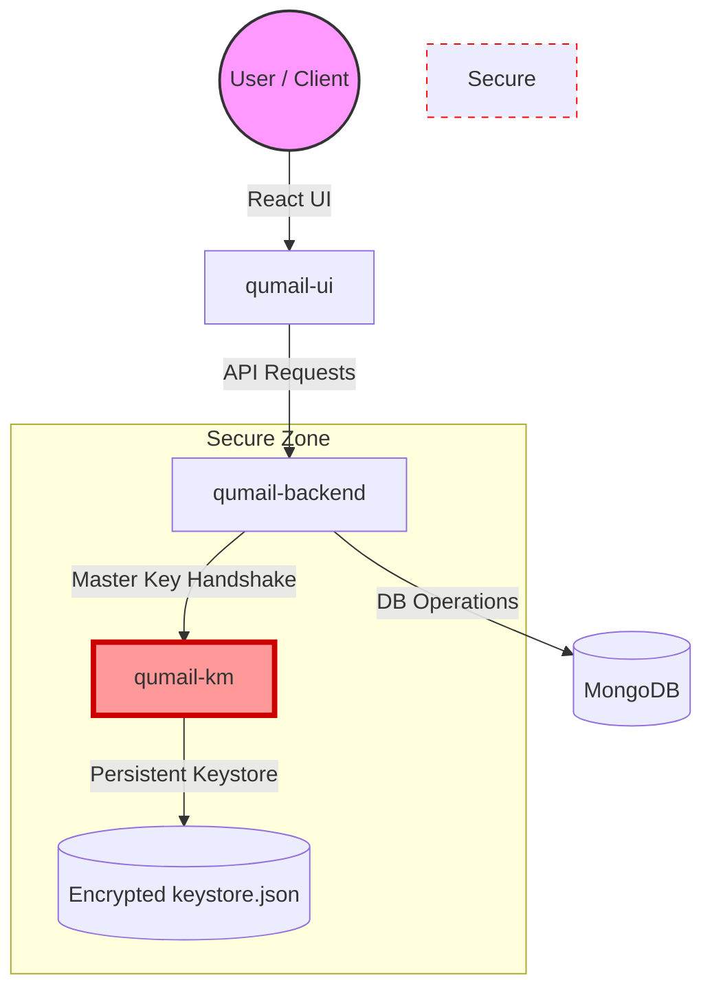

# 🛡️ Qumail: Quantum-Secure Email Platform

[](https://reactjs.org/)
[](https://nodejs.org/)
[](https://www.mongodb.com/)
[](https://mui.com/)
[](https://opensource.org/licenses/MIT)

**Qumail** is a state-of-the-art, zero-knowledge email platform designed for the quantum age. Built with a focus on privacy, security, and a premium user experience, it leverages a distributed architecture to provide truly confidential communication.

---

## ✨ Key Features

- **🔐 Quantum-Secure Encryption**: Support for both **One-Time Pad (OTP)** and **AES-256-GCM** encryption.
- **🛡️ Isolated Key Management**: A separate **Qumail-KM** service handles all master encryption keys, ensuring a "Zero-Knowledge" bond between the backend and your secrets.
- **💎 Premium UI/UX**: A polished, glassmorphic dashboard with smooth animations, customizable themes, and responsive design.
- **🕵️ Zero-Tracking Guarantee**: No third-party analytics, no tracking pixels, and absolute metadata minimization.
- **📜 Privacy-First Architecture**: Built-in privacy manifest and strict data sovereignty tools.
- **🚀 Performance Optimized**: Local caching engine for offline resilience and hardware-accelerated transitions.

---

## 🏗️ System Architecture

Qumail operates as a distributed ecosystem to maximize security boundaries:



---

## 🚀 Getting Started

### 1. Prerequisites
- [Node.js](https://nodejs.org/) (v18+)
- [MongoDB](https://www.mongodb.com/try/download/community) (Running locally or on Atlas)

### 2. Installation & Setup

#### **Clone the Project**
```bash
git clone https://github.com/Skbonde05/qumail.git
cd qumail
```

#### **Phase 1: Key Manager (KM)**
The KM service must be running for the backend to generate encryption keys for new users.
```bash
cd qumail-km
npm install
# Create .env (PORT=6001, KEY_SIZE=32)
npm run dev
```

#### **Phase 2: Primary Backend**
```bash
cd ../qumail-backend
npm install
# Configure .env with MONGODB_URI and KEY_MANAGER_URL=http://localhost:6001
npm run dev
```

#### **Phase 3: Frontend Dashboard**
```bash
cd ../qumail-ui
npm install
# Configure .env with REACT_APP_API_URL=http://localhost:5000
npm start
```

Your dashboard will be available at `http://localhost:3000`.

---

## 🔐 Security Principles

### **Zero-Knowledge Infrastructure**
Unlike traditional email providers, Qumail ensures that the server never sees your raw communication:
- **Client-Side Encryption**: Emails are encrypted on the device before transmission.
- **Key Isolation**: The `qumail-backend` never generates or stores master encryption keys directly; it delegates this to the isolated `qumail-km` service.
- **Pervasive Security**: Real-time audit logs track every login activity and key rotation event.

### **Metadata Minimization**
We strip non-essential routing data and do not maintain logs of IP addresses or device identifiers beyond what is strictly necessary for system health.

---

## 🛠️ Technology Stack

| Layer | Technology |
| :--- | :--- |
| **Frontend** | React 18, Material UI, Framer Motion, Axios, i18next |
| **Backend** | Node.js, Express, Mongoose |
| **KM Service** | Node.js, Crypto-JS, FS Persistence |
| **Security** | Speakeasy (TOTP), AES-256-GCM, Quantum OTP simulations |
| **Database** | MongoDB |

---

## 📄 License

This project is licensed under the MIT License - see the [LICENSE](LICENSE) file for details.

Developed with ❤️ for the Privacy-Conscious Era.
